# Planteamiento del diseño

## Ahorcado — juego electrónico FPGA / PC por enlace serial

EL3313 — Taller de Diseño Digital

| Integrante | Bloque a cargo |
|---|---|
| Mariana Fallas Fallas | Núcleo del juego |
| Abner López Méndez | Subsistema LCD |
| Justin Garita Serrano | Subsistema UART y aplicación de PC |
| Jordi Segura Chinchilla | Periféricos locales e integración |

---

## Objetivos

1. Implementar en una FPGA Nexys 4 el control completo del juego del Ahorcado:
   selección pseudoaleatoria de la palabra, validación de letras, control del
   tiempo y de los intentos, y determinación del resultado de la partida.
2. Diseñar un periférico propio para el LCD PmodCLP con interfaz de registros de
   32 bits, respetando la temporización real del controlador.
3. Diseñar el periférico UART sobre el núcleo provisto y establecer comunicación
   bidireccional confiable con una aplicación en Python.
4. Describir todo el sistema en SystemVerilog sintetizable, con un único reloj de
   100 MHz y sin elementos de memoria no intencionados.
5. Verificar cada bloque mediante testbenches autoverificables antes de
   integrarlo.

Los objetivos son medibles: una partida completa en cada modo de dificultad, con
evidencia de los límites de tiempo e intentos operando, comunicación en ambos
sentidos con la PC, y simulación post-implementación temporizada que cubra la
recepción y validación de una letra.

---

# Nivel 1 — Diagrama de primer nivel

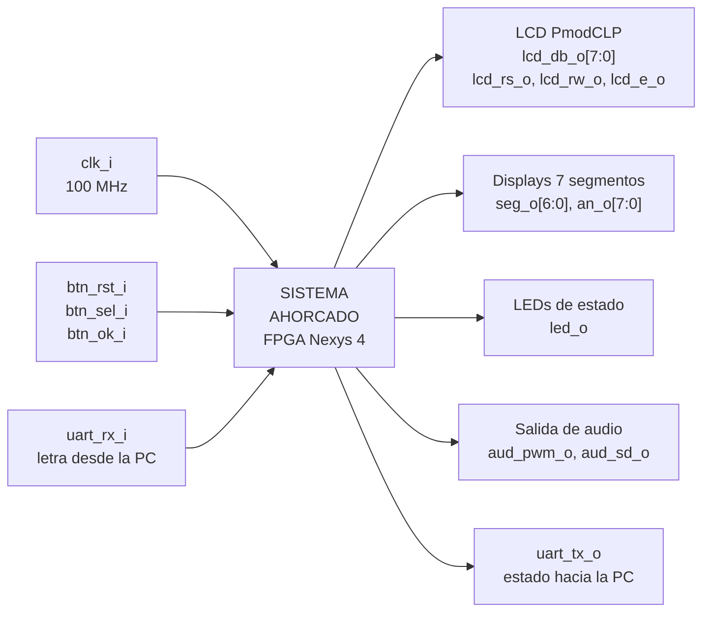

## Objetivo del bloque

Contener la totalidad de la lógica del juego. El sistema decide qué palabra se
juega, si cada letra recibida es correcta, cuánto tiempo queda, cuántos intentos
restan y cuándo termina la partida. La computadora conectada por el enlace serial
no participa en ninguna de esas decisiones: solo entrega la letra que el jugador
escribió y presenta lo que el sistema le informa.

## Entradas

| Señal | Ancho | Origen | Descripción |
|---|---|---|---|
| `clk_i` | 1 | oscilador de la tarjeta | reloj único del sistema, 100 MHz |
| `btn_rst_i` | 1 | pulsador central | reinicia el sistema y el contador de victorias |
| `btn_sel_i` | 1 | pulsador izquierdo | alterna entre modo fácil y difícil |
| `btn_ok_i` | 1 | pulsador derecho | confirma el modo e inicia la partida |
| `uart_rx_i` | 1 | puerto serial de la PC | letra que el jugador desea adivinar |

## Salidas

| Señal | Ancho | Destino | Descripción |
|---|---|---|---|
| `lcd_db_o` | 8 | PmodCLP | bus de datos del LCD |
| `lcd_rs_o` | 1 | PmodCLP | selecciona comando o dato |
| `lcd_rw_o` | 1 | PmodCLP | lectura o escritura, fijo en escritura |
| `lcd_e_o` | 1 | PmodCLP | habilitación; el dato entra en su flanco de bajada |
| `seg_o` | 7 | displays | segmentos del dígito activo |
| `an_o` | 8 | displays | selección del dígito activo |
| `led_o` | 16 | LEDs | estado del sistema y modo seleccionado |
| `aud_pwm_o` | 1 | amplificador integrado | onda cuadrada de retroalimentación sonora |
| `aud_sd_o` | 1 | amplificador integrado | habilitación del amplificador |
| `uart_tx_o` | 1 | puerto serial de la PC | estado de la partida |

## Explicación general

El jugador se sienta frente a la computadora y escribe letras; la tarjeta es
quien lleva el juego. Antes de cada partida el sistema muestra en el LCD una
pantalla de selección donde el pulsador izquierdo alterna entre fácil y difícil,
y el derecho confirma. Al confirmar, el sistema escoge una palabra de un banco
interno de 64 palabras mediante un generador pseudoaleatorio, arranca una cuenta
regresiva y muestra la palabra oculta.

Cada letra que llega por el enlace serial se compara contra la palabra secreta.
Si acierta, todas sus apariciones se revelan a la vez; si falla, se consume uno de
los seis intentos. Una letra que ya se envió antes se ignora sin penalizar. La
partida termina al completar la palabra, al agotar los intentos o al llegar el
tiempo a cero, y en los tres casos el sistema informa el resultado a la
computadora, lo muestra en el LCD durante tres segundos y regresa a la pantalla
de selección.

Mientras tanto, los displays de siete segmentos muestran el tiempo restante y las
partidas ganadas acumuladas, un LED indica en qué etapa está el sistema, y el
amplificador de audio produce tonos distintos para acierto, error, victoria y
derrota.

La razón de concentrar todo en la tarjeta no es solo de enunciado: mantener el
estado del juego en un único lugar elimina la posibilidad de que la computadora y
la FPGA discrepen sobre qué letras se han jugado o cuánto tiempo queda.

---

# Nivel 2 — Diagrama de segundo nivel

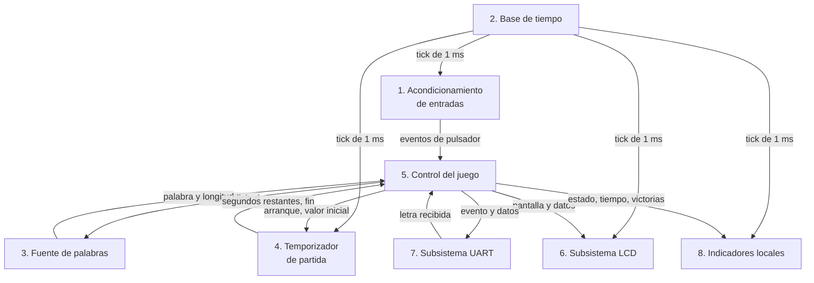

Las flechas de datos van etiquetadas; el tick de 1 ms es la única señal de
control global y se distribuye a los bloques que necesitan medir tiempo.

## 1. Acondicionamiento de entradas

**Objetivo.** Convertir las pulsaciones mecánicas en eventos lógicos limpios de un
solo ciclo, utilizables por una máquina de estados síncrona.

**Entradas.** `btn_rst_i`, `btn_sel_i`, `btn_ok_i` desde los pulsadores; tick de
1 ms desde la base de tiempo.

**Salidas.** Un pulso de un ciclo por cada pulsación válida, y la señal de reset
del sistema.

**Explicación.** Los pulsadores son asíncronos respecto al reloj y rebotan durante
varios milisegundos al presionarse. Si esas señales entraran directamente a la
máquina de estados, una sola pulsación podría contarse varias veces y además
existiría riesgo de metaestabilidad. Este bloque las sincroniza, filtra los
rebotes y entrega un pulso único por pulsación.

## 2. Base de tiempo

**Objetivo.** Producir una referencia temporal común a partir del reloj de
100 MHz, sin crear dominios de reloj adicionales.

**Entradas.** `clk_i`, reset.

**Salidas.** Un pulso de habilitación cada milisegundo.

**Explicación.** Todo lo que el sistema mide en tiempo real —el filtrado de
rebotes, la cuenta regresiva, el barrido de los displays, la duración de la
pantalla de resultado— necesita una referencia mucho más lenta que el reloj. En
lugar de dividir el reloj, que crearía un segundo dominio y complicaría el
análisis temporal, se genera un pulso de habilitación periódico. El resto de los
bloques siguen operando con el reloj de 100 MHz y simplemente avanzan cuando ese
pulso está activo.

## 3. Fuente de palabras

**Objetivo.** Entregar una palabra del banco, elegida de forma pseudoaleatoria y
válida para el modo de dificultad solicitado.

**Entradas.** Modo de dificultad y una señal de solicitud desde el control del
juego.

**Salidas.** La palabra en formato de longitud fija y su longitud real.

**Explicación.** Reúne el banco de palabras y el generador pseudoaleatorio porque
juntos resuelven una sola pregunta: qué se juega esta partida. El banco está
organizado de modo que las palabras aptas para el modo difícil ocupan la primera
mitad de los índices, lo que permite restringir el rango sin necesidad de buscar
ni descartar candidatas.

## 4. Temporizador de partida

**Objetivo.** Llevar la cuenta regresiva del tiempo disponible y avisar cuando se
agota.

**Entradas.** Tick de 1 ms, valor inicial según el modo, señal de arranque.

**Salidas.** Segundos restantes y aviso de tiempo agotado.

**Explicación.** Se mantiene separado del control del juego porque su
comportamiento es independiente de las reglas: una vez arrancado, cuenta hacia
atrás sin importar qué letras lleguen. Esa separación permite verificarlo por sí
solo y evita que la máquina de estados principal cargue con la aritmética del
tiempo.

## 5. Control del juego

**Objetivo.** Aplicar las reglas del Ahorcado y decidir el resultado de la
partida.

**Entradas.** Eventos de pulsador, letra recibida, palabra y longitud, aviso de
tiempo agotado.

**Salidas.** Solicitud de palabra, arranque del temporizador, qué mostrar en el
LCD, qué notificar a la computadora, y el estado del juego para los indicadores.

**Explicación.** Es el único bloque que decide. Sabe qué letras se han usado, qué
posiciones están reveladas, cuántos errores van y en qué etapa está la partida.
Los demás bloques ejecutan lo que este ordena, pero ninguno determina por su
cuenta si se ganó o se perdió. Concentrar las decisiones en un solo lugar hace
que las reglas del juego se puedan leer y verificar en un solo módulo.

## 6. Subsistema LCD

**Objetivo.** Convertir una orden de alto nivel —«muestra la pantalla de
selección», «muestra la palabra con estos aciertos»— en la secuencia de
transacciones físicas que el controlador del LCD necesita.

**Entradas.** Identificador de pantalla y los datos del juego que aparecen en
ella; tick de 1 ms.

**Salidas.** Bus de datos y señales de control hacia el PmodCLP; aviso de
ocupado hacia el control del juego.

**Explicación.** El controlador del LCD acepta un byte a la vez y exige esperas
de decenas de microsegundos a milisegundos entre operaciones. Mostrar una
pantalla completa son más de treinta transacciones encadenadas. Si esa
secuenciación viviera dentro del control del juego, la máquina de estados
principal crecería en decenas de estados dedicados a mover caracteres y las
reglas del juego quedarían mezcladas con el formateo del texto. Por eso el
subsistema recibe la orden completa y la ejecuta por su cuenta, avisando cuando
termina.

## 7. Subsistema UART

**Objetivo.** Recibir las letras que envía la computadora y transmitirle el
estado de la partida siguiendo un protocolo de texto definido.

**Entradas.** `uart_rx_i`; eventos y datos del juego desde el control.

**Salidas.** `uart_tx_o`; la letra recibida hacia el control del juego.

**Explicación.** Del mismo modo que el LCD, el enlace serial transmite un byte a
la vez y cada mensaje del protocolo son varias decenas de bytes. El subsistema
traduce un evento del juego —«empezó la partida», «esta letra acertó»— en la
trama de texto correspondiente y la envía byte por byte. En sentido contrario,
descarta cualquier byte que no sea una letra mayúscula antes de entregarlo.

Las dos direcciones viven en el mismo bloque a propósito. Leer la letra obliga a
consultar el aviso de byte nuevo, leer el registro de recepción y escribir el bit
que lo limpia, todo sobre el mismo bus por el que salen las tramas. Si el control
del juego leyera por su cuenta habría dos módulos manejando el mismo periférico,
con una trama saliendo y una letra entrando a la vez. Con la recepción aquí, cada
periférico conserva un único maestro, igual que el LCD.

El núcleo serial no lo diseña el equipo: el curso lo entregó en VHDL y sobre él
se construye el periférico. El equipo aporta una envoltura en SystemVerilog que
lo adapta a la interfaz que espera el periférico.

## 8. Indicadores locales

**Objetivo.** Mostrar el estado del sistema en la propia tarjeta, sin depender de
la computadora.

**Entradas.** Estado del juego, tiempo restante, partidas ganadas, eventos
sonoros; tick de 1 ms.

**Salidas.** Segmentos y ánodos de los displays, LEDs, señales del amplificador.

**Explicación.** Agrupa los tres periféricos de salida que no requieren protocolo
ni handshake: basta con reflejar continuamente el estado que reciben. Los
displays se multiplexan porque los cuatro dígitos comparten las líneas de
segmento, y el sonido se produce generando ondas cuadradas de distinta frecuencia
según el evento.

---

## Explicación del sistema en conjunto

El sistema tiene un único punto de decisión y varios ejecutores. El control del
juego es el punto de decisión: mantiene el estado de la partida y es el único que
puede cambiarlo. A su alrededor hay bloques que le entregan información —la
fuente de palabras, el temporizador, el acondicionamiento de entradas y la
recepción serial— y bloques que ejecutan lo que ordena: el LCD, la transmisión
serial y los indicadores.

Esa forma responde a una característica del problema: casi todos los periféricos
del sistema son lentos comparados con el reloj y necesitan secuencias de varios
pasos. Si el control del juego tuviera que manejar esas secuencias, terminaría
siendo un módulo enorme donde las reglas del Ahorcado quedarían enterradas entre
esperas y contadores. Al delegar cada secuencia a su propio bloque, el control
conserva un tamaño que permite leerlo, verificarlo y explicarlo.

La base de tiempo atraviesa el sistema entero y es lo que permite cumplir con el
requisito de un solo reloj: en lugar de generar frecuencias distintas para cada
periférico, todos operan a 100 MHz y avanzan cuando les corresponde.

---

# Nivel 3 — Diagrama de tercer nivel

En esta sección las **líneas continuas transportan datos** y las **punteadas,
control**. Junto a cada línea de datos se indica su ancho en bits.

El tick de 1 ms no se dibuja: llega desde `clk_tick_gen` a los tres
`button_input`, al `round_timer`, al `lcd_controller`, al `display_controller` y
al `buzzer_controller`. Dibujar esas seis líneas cruzaría el diagrama entero sin
aportar información.

## 3.1 Núcleo del juego

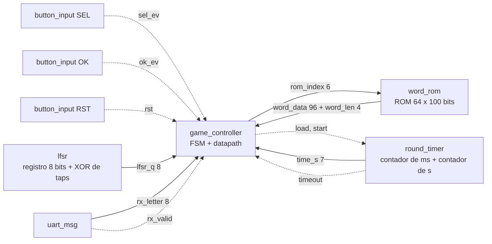

## 3.2 Cadenas de presentación e indicadores

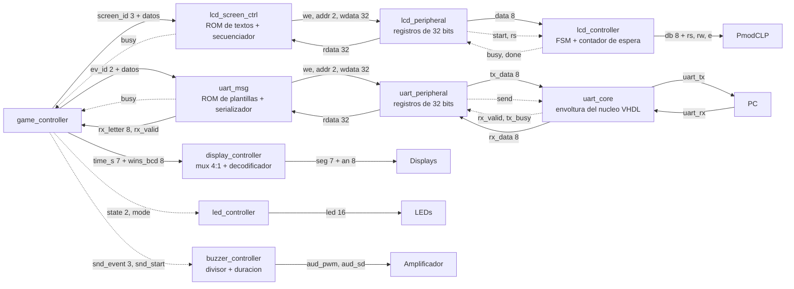

## 3.3 Composición funcional de cada módulo

| Módulo | Elementos funcionales |
|---|---|
| `clk_tick_gen` | contador de 17 bits, comparador contra 99 999, recarga |
| `button_input` | dos flip-flops en cascada, contador de 4 bits sobre el tick, registro de un bit y compuerta de flanco |
| `lfsr` | registro de desplazamiento de 8 bits, XOR de cuatro entradas, mux de carga de semilla |
| `word_rom` | ROM combinacional de 64 × 100 bits, decodificador de índice de 6 bits |
| `round_timer` | contador de ms módulo 1000, contador descendente de segundos de 7 bits, comparador con cero, mux del valor inicial |
| `game_controller` | ver 3.4 y 3.5 |
| `lcd_screen_ctrl` | ROM de textos fijos, contador de posición de 5 bits, mux de fuente de carácter, FSM |
| `lcd_peripheral` | tres registros de 32 bits, decodificador de dirección, mux de lectura 4:1, lógica de set y clear por bit |
| `lcd_controller` | FSM de inicialización y escritura, contador de espera de 18 bits, registros de salida |
| `uart_msg` | ROM de plantillas, contador de byte, mux de fuente, conversor de binario a ASCII, comparador de rango A-Z, FSM de transmisión y recepción |
| `uart_core` | envoltura del núcleo VHDL: biestable de petición sostenida y generación del nivel de ocupado |
| `uart_peripheral` | tres registros de 32 bits, decodificador de dirección, mux de lectura, biestables de `send` y `new_rx` |
| `display_controller` | contador de dígito de 2 bits, mux 4:1 de nibbles, decodificador BCD a siete segmentos, decodificador de ánodo |
| `buzzer_controller` | contador divisor de 17 bits, comparador de semiperiodo, biestable de salida, contador de duración, FSM de tonos |
| `led_controller` | decodificador de estado a tres salidas, compuerta de modo |

Ningún bloque queda como caja negra: todos se descomponen en contadores,
registros, multiplexores, comparadores y decodificadores.

## 3.4 Datapath de evaluación de una letra

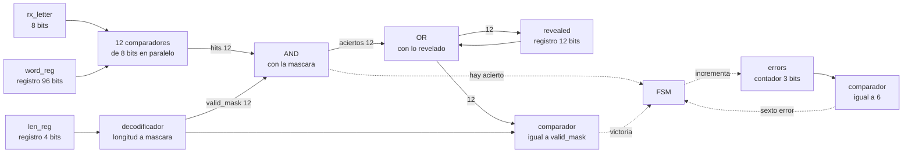

**Objetivo.** Decidir, en un solo ciclo, si la letra recibida acierta y si con
ella se completa la palabra.

**Entradas.** `rx_letter` de 8 bits, los registros de palabra y longitud, el
registro de posiciones reveladas.

**Salidas.** El registro de reveladas actualizado, y hacia la máquina de estados
las condiciones de acierto, victoria y sexto error.

**Explicación.** Los doce comparadores trabajan a la vez, que es lo que permite
revelar todas las apariciones de una letra en el mismo ciclo en lugar de
recorrerlas una por una. La máscara de validez que produce el decodificador
impide que una coincidencia en una posición de relleno cuente como acierto.

El comparador de victoria se alimenta de la salida del OR y no del registro, de
modo que la letra que completa la palabra se reconoce en el mismo procesamiento.
Si se leyera el registro, la victoria se detectaría un ciclo tarde y habría que
añadir un estado para compensarlo.

## 3.5 Datapath de letra repetida y arranque de partida

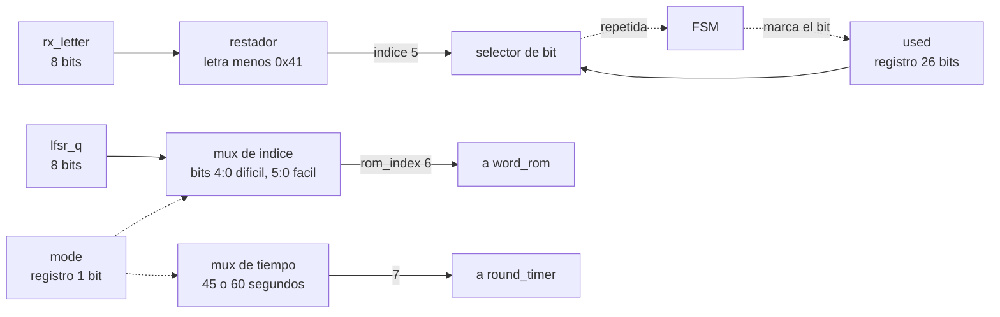

**Explicación.** El registro de letras usadas resuelve la repetición en tiempo
constante: el restador convierte la letra en un índice de cinco bits y el
selector consulta ese bit directamente, sin comparar contra la palabra.

Los dos multiplexores gobernados por `mode` son la única diferencia estructural
entre los modos de dificultad. Uno recorta el índice a cinco bits para que caiga
forzosamente en el rango de palabras largas; el otro escoge el valor inicial del
temporizador. No hay lógica de búsqueda ni de descarte en ninguno de los dos
caminos.

## 3.6 Máquina de estados del control principal

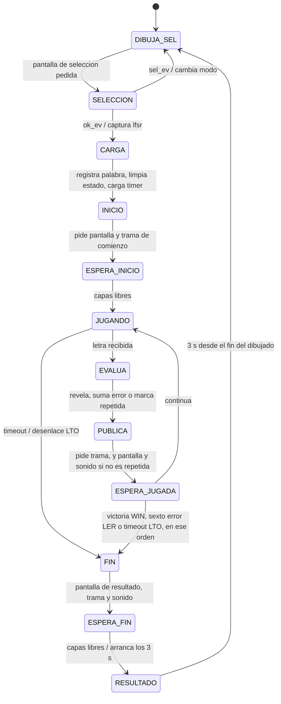

El contador de victorias sube al entrar en `FIN`, y solo si el desenlace es
victoria.

Doce estados, de los cuales cuatro son de espera. Existen porque las capas de
presentación tardan milisegundos en completar una pantalla o una trama: sin
ellos la máquina avanzaría antes de que el mensaje saliera y el jugador vería
información desactualizada.

**Un solo estado de fin, no tres.** Ganar, perder por fallos y perder por tiempo
hacen exactamente lo mismo: pintar, notificar, sonar y esperar. Lo único que
cambia es un código de dos bits, y ese código es justo lo que las dos capas de
presentación reciben como entrada. Tres estados que solo se diferencian en un
dato pertenecen al camino de datos y no al control; con estados separados habría
que escribir la misma secuencia de publicación tres veces. La diferencia sigue
viéndose donde importa: el LCD muestra `GANASTE`, `PERDISTE: FALLOS` o
`PERDISTE: TIEMPO`, y la computadora recibe `WIN`, `LER` o `LTO`.

**`CARGA` va aparte de `INICIO`** porque las capas copian los datos en el mismo
flanco en que aceptan la orden. Registrar la palabra y disparar el dibujo en el
mismo estado haría que copiaran los valores viejos.

El orden de salida de `ESPERA_JUGADA` es victoria, luego sexto error, luego
vencimiento del tiempo. Ese orden importa: una letra que completa la palabra no
puede ser a la vez el error que hace perder la partida.

El vencimiento del tiempo se atiende solo con las capas libres, para no cortar
una pantalla a medias ni una trama por la mitad. La señal es un nivel y no un
pulso, así que sigue presente cuando la máquina llega al estado de espera.

Una letra repetida no cambia nada visible ni consume intento, así que solo se
avisa a la computadora: no se redibuja ni suena.

## 3.7 Máquina de estados del periférico LCD

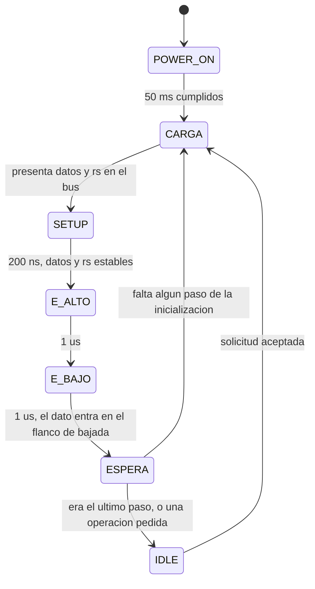

**Los cuatro comandos de arranque no son cuatro estados.** `Function Set`,
`Display On`, `Clear Display` y `Entry Mode` recorren exactamente el mismo ciclo
de bus y solo se diferencian en el byte que se emite y en la espera que sigue.
Un contador de paso de dos bits elige ambos, y el ciclo se escribe una sola vez.
Cuando ese contador llega al final, un biestable marca la inicialización como
terminada y a partir de ahí `ESPERA` vuelve a `IDLE` en lugar de a `CARGA`.

La inicialización arranca sola al salir de configuración, sin depender del
pulsador de reinicio, porque el LCD debe quedar listo al encender la tarjeta. Un
reinicio durante la operación normal aborta la transacción en curso y vuelve a
reposo, pero nunca repite los 50 ms de arranque, que ya no hacen falta.

Las esperas de la columna izquierda están tomadas del manual del PmodCLP. Los
tiempos del ciclo de bus, que ese manual no especifica, se fijaron con margen
amplio y quedan como decisión del equipo sujeta a comprobación sobre la tarjeta.

Mientras la máquina no esté en `IDLE`, `busy` está activo y cualquier solicitud
nueva se descarta. Esperar es responsabilidad de la capa de presentación.

## 3.8 Funcionamiento del conjunto

En la pantalla de selección, cada pulsación del botón izquierdo llega al control
del juego como un pulso de un ciclo, cambia el registro de modo y dispara un
redibujado. El registro del generador pseudoaleatorio, mientras tanto, avanza en
cada flanco de reloj sin que nadie lo observe.

Al pulsar el botón derecho, el control captura el valor del generador en ese
ciclo exacto. El multiplexor de índice lo recorta según el modo y lo presenta
como dirección de la memoria de palabras. La palabra y su longitud entran a los
registros del datapath, el decodificador produce la máscara de validez, los
registros de reveladas y de letras usadas se limpian, el contador de errores
queda en cero y el temporizador arranca con el valor del otro multiplexor.

Durante la partida, cada byte que entra por el enlace serial queda en el registro
de recepción del periférico y levanta su bandera. El control lo lee, descarta lo
que no sea una letra mayúscula y consulta el bit correspondiente en el registro
de letras usadas. Si ya estaba puesto, notifica y vuelve a esperar. Si no, los
doce comparadores evalúan la letra contra todas las posiciones a la vez, el AND
descarta las posiciones de relleno y el OR produce el patrón nuevo, que es el que
entra al comparador de victoria.

El resultado viaja por dos caminos en paralelo: la capa del LCD lo convierte en
la secuencia de escrituras que actualiza la pantalla, y la del enlace serial en
las líneas de texto que recibe la computadora. El control espera a que ambas
terminen antes de aceptar la siguiente letra.

La partida termina de tres formas y las tres desembocan en el mismo estado de
resultado. Solo la victoria incrementa el contador BCD que alimenta los dos
dígitos derechos del display. Tres segundos después de que la pantalla terminó de
dibujarse, el sistema vuelve a la selección de modo con el generador en otra
posición, de manera que la siguiente partida use otra palabra.

---

# Nivel 5 — Diagramas de quinto nivel

## Nota sobre la adaptación de este nivel

La metodología pide en este nivel dos planos: la unión de todos los esquemáticos
por compuertas, y la unión de todos los diagramas de conexiones eléctricas por
chips, este último pensado para que un técnico pueda alambrar el circuito
siguiéndolo sin equivocarse.

El proyecto se implementa en una FPGA, no con circuitos integrados sobre
protoboard, así que ninguno de los dos planos existe en su forma original. La
adaptación que aplicamos es:

- **Plano 1**, en lugar del esquemático por compuertas, es el diagrama completo
  del sistema con todos los módulos y todas las señales que los unen. Cumple la
  misma función que describe el método: permitir analizar y revisar la solución
  entera de un vistazo. El detalle por compuertas lo produce la herramienta de
  síntesis a partir del RTL, y se revisa en el netlist.
- **Plano 2**, en lugar del alambrado por chips, es el diagrama de conexiones
  físicas entre la tarjeta y el mundo exterior, con los números de pin. En una
  Nexys 4 la mayoría de los periféricos ya están cableados en la tarjeta, así que
  lo único que alguien tiene que conectar a mano es el módulo LCD. Ese es el
  plano que sirve para armar el montaje sin inducir errores.

## Plano 1 — Diagrama esquemático total

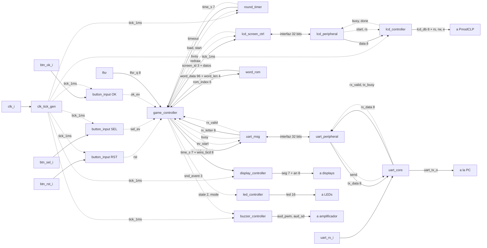

Este plano reúne los dieciséis módulos que instancia el bloque superior y todas
las señales que los conectan. No aparece `uart_test_block`, que sustituye a la
capa de protocolo como maestro del periférico UART cuando se activa el modo de
prueba por parámetro; en síntesis solo queda uno de los dos. Las
líneas continuas llevan datos con su ancho indicado, las punteadas llevan
control, y las flechas dobles representan la interfaz estándar de registros de
32 bits, que en ambos sentidos son `write_enable`, `addr`, `wdata` y `rdata`.

Sirve para dos cosas concretas durante el desarrollo. Primero, para comprobar que
el módulo superior instancia y conecta exactamente estas señales y ninguna más.
Segundo, para localizar el origen de un problema durante la integración: si el
LCD muestra basura, el camino a revisar está delimitado a cuatro bloques y las
señales entre ellos.

## Plano 2 — Diagrama de conexiones físicas

### Conexión del módulo LCD

Es la única conexión que se hace a mano. El PmodCLP tiene dos conectores: uno de
doce pines con el bus de datos y otro de seis con las señales de control.

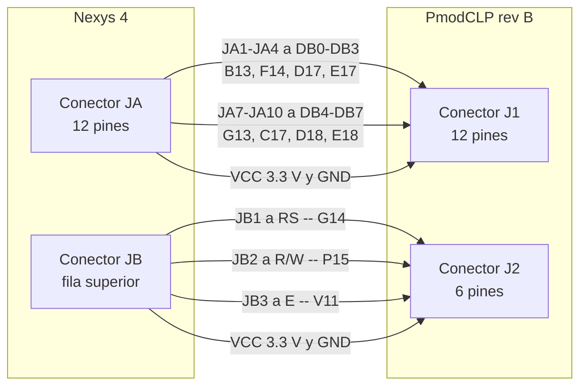

| PmodCLP | Señal | Pmod Nexys 4 | Pin FPGA |
|---|---|---|---|
| J1-1 | `DB0` | JA1 | B13 |
| J1-2 | `DB1` | JA2 | F14 |
| J1-3 | `DB2` | JA3 | D17 |
| J1-4 | `DB3` | JA4 | E17 |
| J1-7 | `DB4` | JA7 | G13 |
| J1-8 | `DB5` | JA8 | C17 |
| J1-9 | `DB6` | JA9 | D18 |
| J1-10 | `DB7` | JA10 | E18 |
| J2-1 | `RS` | JB1 | G14 |
| J2-2 | `R/W` | JB2 | P15 |
| J2-3 | `E` | JB3 | V11 |
| J1-5, J1-11, J2-5 | `GND` | GND del conector | — |
| J1-6, J1-12, J2-6 | `VCC` | VCC del conector | — |

Tres advertencias para el montaje:

1. **La revisión B del PmodCLP funciona a 3.3 V.** Los conectores Pmod de la
   Nexys 4 entregan 3.3 V, así que la alimentación es directa. La revisión A del
   mismo módulo requiere 5 V y no debe conectarse a estos conectores.
2. **J1 ocupa el conector JA completo**, incluidas sus dos filas. J2 ocupa
   únicamente la fila superior de JB, y la fila inferior queda libre.
3. **El pin 4 de J2 no está conectado** en el módulo. Corresponde a la
   retroiluminación opcional y en el PmodCLP no se usa.

### Conexiones internas de la tarjeta

El resto de los periféricos ya están cableados en la placa. Lo único que hay que
hacer es declarar los pines correctos en el archivo de restricciones.

| Función | Puerto del diseño | Elemento en la tarjeta | Pin |
|---|---|---|---|
| Reloj | `clk_i` | oscilador de 100 MHz | E3 |
| Reinicio | `btn_rst_i` | pulsador central `BTNC` | E16 |
| Selección de modo | `btn_sel_i` | pulsador izquierdo `BTNL` | T16 |
| Confirmación | `btn_ok_i` | pulsador derecho `BTNR` | R10 |
| Recepción serial | `uart_rx_i` | puente USB-UART | C4 |
| Transmisión serial | `uart_tx_o` | puente USB-UART | D4 |
| Segmentos | `seg_o[6:0]` | cátodos CA a CG | L3, N1, L5, L4, K3, M2, L6 |
| Dígitos | `an_o[7:0]` | ánodos AN0 a AN7 | N6, M6, M3, N5, N2, N4, L1, M1 |
| Estado | `led_o[2:0]` | LED0 a LED2 | T8, V9, R8 |
| Modo | `led_o[15]` | LED15 | P2 |
| Audio | `aud_pwm_o` | entrada del amplificador | A11 |
| Habilitación de audio | `aud_sd_o` | habilitación del amplificador | D12 |

**Nota sobre el pulsador de reinicio.** La tarjeta tiene dos botones que podrían
confundirse: el central, `BTNC` en E16, y uno rotulado `CPU RESET` en C12, que es
un botón distinto y de polaridad contraria. El diseño usa el central. Conectar el
otro por error produciría un reinicio permanente.

**Nota sobre la salida de audio.** La Nexys 4 no lleva zumbador. El sonido sale
por el amplificador integrado hacia el conector de audio de 3.5 mm, de modo que
la demostración necesita audífonos o un parlante amplificado conectado ahí.

### Alimentación

La tarjeta se alimenta por el puerto USB, que además provee el puente serial
hacia la computadora. Un solo cable USB cubre alimentación, programación y
enlace de datos. El módulo LCD toma su alimentación de los conectores Pmod, así
que no requiere fuente externa.

## Verificación del montaje antes de encender

Antes de programar la tarjeta por primera vez conviene comprobar tres cosas, en
este orden:

1. Que el PmodCLP esté orientado correctamente, con el pin 1 de cada conector
   coincidiendo con el pin 1 del conector de la tarjeta.
2. Que el archivo de restricciones declare exactamente los pines de las tablas
   anteriores, sin puertos sobrantes ni faltantes.
3. Que las polaridades supuestas para pulsadores, LEDs, segmentos, ánodos y
   habilitación del amplificador sean las correctas. Están declaradas como
   parámetros del módulo superior, de modo que si alguna resulta invertida se
   corrige en una línea sin tocar la lógica.

---

# Nivel 4 — Desarrollo individual de los módulos

Este nivel no tiene límite de extensión. Cada módulo se desarrolla siguiendo la
misma estructura, y cada integrante escribe la de los módulos que le
corresponden.

## Estructura que sigue cada módulo

1. Nombre del módulo
2. Diagrama modular, tomado del nivel 3
3. Objetivo
4. Entradas
5. Salidas
6. Relación con otros módulos
7. Funcionamiento
8. Diseño: cómo se llega a esa estructura, con las tablas y los cálculos que la
   justifican
9. Estructura RTL

Los puntos 9 y 10 del método original —esquemático por compuertas y diagrama de
conexiones por chips— se sustituyen por el punto 9 de esta lista, según la
adaptación declarada en el nivel 5.

A continuación se desarrollan los módulos del bloque de periféricos locales e
integración. Los demás bloques siguen esta misma estructura.

---

## 4.1 `clk_tick_gen`

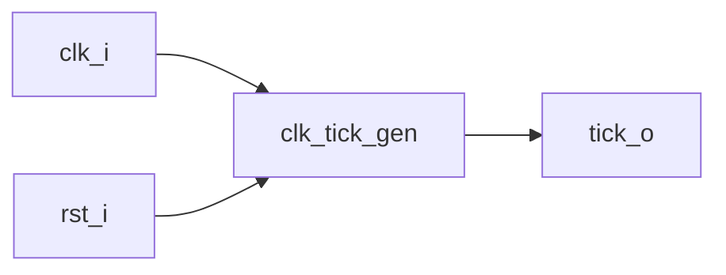

### Objetivo

Producir un pulso de habilitación de un ciclo de duración cada milisegundo, para
que el resto del sistema pueda medir tiempo sin necesidad de un segundo reloj.

### Entradas

| Señal | Ancho | Descripción |
|---|---|---|
| `clk_i` | 1 | reloj del sistema, 100 MHz |
| `rst_i` | 1 | reinicio síncrono, activo en alto |

### Salidas

| Señal | Ancho | Descripción |
|---|---|---|
| `tick_o` | 1 | pulso de un ciclo, una vez por milisegundo |

Parámetro: `TICK_CYCLES`, por defecto 100 000.

### Relación con otros módulos

Es la fuente de tiempo de todo el sistema. Su salida alimenta las tres instancias
de `button_input`, el `round_timer`, el `lcd_controller`, el
`display_controller` y el `buzzer_controller`. Ningún otro módulo mide tiempo por
su cuenta.

### Funcionamiento

Un contador avanza una unidad en cada flanco de reloj. Cuando alcanza el valor
límite, `tick_o` se pone en alto durante ese único ciclo y el contador vuelve a
cero. El ciclo se repite indefinidamente.

### Diseño

El valor límite sale de la relación entre la frecuencia del reloj y el período
deseado:

```
100 000 000 ciclos/s ÷ 1000 ms/s = 100 000 ciclos por milisegundo
```

El contador debe llegar hasta 99 999, así que su ancho es:

```
ceil(log2(100 000)) = 17 bits        2^17 = 131 072 >= 100 000
```

El período resultante es exacto: 100 000 ciclos de 10 ns son exactamente 1 ms,
sin error de redondeo. Esto importa porque de este tick dependen los 60 segundos
de la partida; un error acumulado se notaría al final de la cuenta.

| Estado del contador | `tick_o` | Siguiente valor |
|---|---|---|
| 0 a 99 998 | 0 | contador + 1 |
| 99 999 | 1 | 0 |

`tick_o` se genera como salida directa del comparador y no se registra. Un tick
registrado llegaría un ciclo tarde y obligaría a compensar ese retardo en cada
consumidor. Como la señal solo se usa como habilitación de lógica síncrona, un
posible glitch combinacional se estabiliza mucho antes del siguiente flanco.

Se descartó dividir el reloj para obtener 1 kHz: eso crearía un segundo dominio,
obligaría a restricciones de reloj adicionales y a sincronizadores entre dominios,
a cambio de nada.

### Estructura RTL

```systemverilog
module clk_tick_gen #(
    parameter int TICK_CYCLES = 100_000
) (
    input  logic clk_i,
    input  logic rst_i,
    output logic tick_o
);
    localparam int W = $clog2(TICK_CYCLES);
    logic [W-1:0] cnt_q;

    assign tick_o = (cnt_q == TICK_CYCLES - 1);

    always_ff @(posedge clk_i) begin
        if (rst_i)      cnt_q <= '0;
        else if (tick_o) cnt_q <= '0;
        else             cnt_q <= cnt_q + 1'b1;
    end
endmodule
```

---

## 4.2 `button_input`

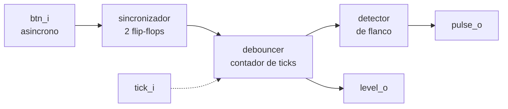

### Objetivo

Convertir la señal de un pulsador mecánico, asíncrona respecto al reloj y con
rebotes, en un pulso limpio de un ciclo utilizable por una máquina de estados.

### Entradas

| Señal | Ancho | Descripción |
|---|---|---|
| `clk_i` | 1 | reloj del sistema |
| `rst_i` | 1 | reinicio síncrono |
| `tick_i` | 1 | pulso de 1 ms desde `clk_tick_gen` |
| `btn_i` | 1 | entrada física del pulsador |

### Salidas

| Señal | Ancho | Descripción |
|---|---|---|
| `pulse_o` | 1 | un ciclo en alto por cada pulsación válida |
| `level_o` | 1 | nivel estable ya filtrado |

Parámetros: `DEBOUNCE_MS`, por defecto 10; `BTN_ACTIVE_LEVEL`, por defecto 1.

### Relación con otros módulos

Se instancia tres veces. Las instancias de selección y confirmación entregan
`pulse_o` al `game_controller` como eventos. La instancia de reinicio entrega
`level_o`, de modo que el sistema permanece en reset mientras el botón esté
presionado y no solo durante un ciclo.

### Funcionamiento

La entrada atraviesa tres etapas. Primero, dos flip-flops en cascada la llevan al
dominio del reloj. Después, un contador mide cuánto tiempo lleva la señal
sincronizada difiriendo del nivel considerado estable; si el desacuerdo se
mantiene durante el número de milisegundos configurado, ese nuevo nivel se adopta
como estable. Por último, un registro de un bit compara el nivel estable con su
valor anterior y produce un pulso en la transición de reposo a presionado.

### Diseño

**Por qué dos flip-flops.** El pulsador cambia en cualquier instante respecto al
reloj, de modo que puede violar los tiempos de establecimiento del primer
flip-flop y dejarlo en estado metaestable. El segundo flip-flop le da un ciclo
completo para resolverse. Es la técnica estándar para entradas asíncronas de un
solo bit y su costo es de dos registros.

**Por qué 10 ms.** Los contactos de un pulsador mecánico rebotan típicamente
durante unos pocos milisegundos. Diez milisegundos dejan margen sobre ese valor y
siguen siendo imperceptibles para quien pulsa: nadie nota un retardo de una
centésima de segundo. Un valor mucho mayor empezaría a sentirse pesado; uno menor
dejaría pasar rebotes.

El contador cuenta ticks de 1 ms, así que su ancho es:

```
ceil(log2(10)) = 4 bits
```

| Comparación | Acción del contador | Nivel estable |
|---|---|---|
| `btn_sync` igual al nivel estable | vuelve a 0 | sin cambio |
| distintos y cuenta menor que `DEBOUNCE_MS` | +1 en cada tick | sin cambio |
| distintos y cuenta igual a `DEBOUNCE_MS` | vuelve a 0 | adopta `btn_sync` |

**Por qué contar solo mientras hay desacuerdo.** Un rebote hace que la señal
oscile; cada oscilación devuelve el contador a cero y obliga a empezar de nuevo.
Solo un nivel sostenido durante los 10 ms completos consigue cambiar el estado.

**Por qué el detector de flanco es necesario.** Sin él, el `game_controller`
vería el botón presionado durante millones de ciclos y cambiaría de modo miles de
veces con una sola pulsación. El pulso de un ciclo garantiza que cada pulsación
produce exactamente un evento.

El parámetro de polaridad se aplica al entrar, de modo que el resto del módulo
trabaja siempre con la convención de que uno significa presionado.

### Estructura RTL

```systemverilog
module button_input #(
    parameter int   DEBOUNCE_MS      = 10,
    parameter logic BTN_ACTIVE_LEVEL = 1'b1
) (
    input  logic clk_i,
    input  logic rst_i,
    input  logic tick_i,
    input  logic btn_i,
    output logic pulse_o,
    output logic level_o
);
    localparam int W = $clog2(DEBOUNCE_MS + 1);

    logic sync_q1, sync_q2, btn_norm;
    logic stable_q, stable_d1;
    logic [W-1:0] cnt_q;

    assign btn_norm = (btn_i == BTN_ACTIVE_LEVEL);
    assign level_o  = stable_q;
    assign pulse_o  = stable_q & ~stable_d1;

    always_ff @(posedge clk_i) begin
        sync_q1 <= btn_norm;
        sync_q2 <= sync_q1;
    end

    always_ff @(posedge clk_i) begin
        if (rst_i) begin
            cnt_q <= '0; stable_q <= 1'b0;
        end else if (sync_q2 == stable_q) begin
            cnt_q <= '0;
        end else if (tick_i) begin
            if (cnt_q == DEBOUNCE_MS[W-1:0]) begin
                stable_q <= sync_q2; cnt_q <= '0;
            end else begin
                cnt_q <= cnt_q + 1'b1;
            end
        end
    end

    always_ff @(posedge clk_i) stable_d1 <= stable_q;
endmodule
```

---

## 4.3 `display_controller`

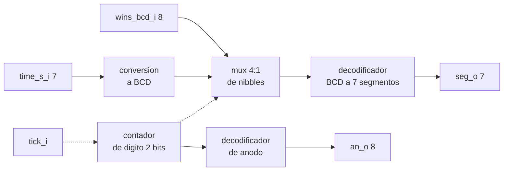

### Objetivo

Mostrar el tiempo restante y las partidas ganadas en cuatro dígitos de siete
segmentos que comparten las líneas de segmento.

### Entradas

| Señal | Ancho | Descripción |
|---|---|---|
| `clk_i`, `rst_i` | 1 | reloj y reinicio |
| `tick_i` | 1 | pulso de 1 ms |
| `time_s_i` | 7 | segundos restantes, 0 a 60 |
| `wins_bcd_i` | 8 | victorias en BCD, dos dígitos |

### Salidas

| Señal | Ancho | Descripción |
|---|---|---|
| `seg_o` | 7 | segmentos del dígito activo |
| `an_o` | 8 | selección de dígito |

Parámetros: `SEG_ACTIVE_LEVEL` y `AN_ACTIVE_LEVEL`, ambos por defecto 0.

### Relación con otros módulos

Recibe del `game_controller` los dos valores que muestra y no interpreta nada
más: no sabe en qué estado está la partida. Recibe el tick de `clk_tick_gen` para
el barrido.

### Funcionamiento

Los cuatro dígitos comparten físicamente las siete líneas de segmento, así que
solo puede haber uno encendido en cada instante. El contador de dígito avanza con
cada tick y selecciona a la vez qué nibble se decodifica y qué ánodo se activa.
Al repetir el barrido lo bastante rápido, el ojo percibe los cuatro dígitos
encendidos de forma continua.

### Diseño

**Frecuencia de barrido.** Con un dígito por milisegundo, el ciclo completo de
cuatro dígitos dura 4 ms:

```
1 / 4 ms = 250 Hz
```

El umbral de fusión de parpadeo del ojo humano está alrededor de 60 Hz, así que
250 Hz queda cómodamente por encima. Reutilizar el tick de 1 ms evita añadir un
contador dedicado.

**Distribución de los dígitos.**

| Contador | Ánodo activo | Contenido |
|---|---|---|
| 0 | AN0 | unidades de victorias |
| 1 | AN1 | decenas de victorias |
| 2 | AN2 | unidades de segundos |
| 3 | AN3 | decenas de segundos |

`AN7` a `AN4` se mantienen inactivos de forma permanente.

**Conversión del tiempo a BCD.** El temporizador entrega los segundos en binario,
de 0 a 60, mientras que el decodificador necesita dígitos decimales por separado.
La conversión es una división entera entre diez y su residuo. Como el divisor es
constante y el rango está acotado a 61 valores, la herramienta de síntesis lo
resuelve con una red pequeña de LUTs y no con un divisor real.

Si en la implementación esa red resultara costosa, la alternativa es que el
`round_timer` cuente directamente en BCD, lo que traslada el problema a dos
contadores de década encadenados. Se prefirió la conversión porque mantiene el
temporizador más simple de verificar.

**Tabla de verdad del decodificador.** Con `seg_o` en el orden `{g,f,e,d,c,b,a}`
y un uno indicando segmento encendido:

| Dígito | g f e d c b a | Hex |
|---|---|---|
| 0 | 0 1 1 1 1 1 1 | 3F |
| 1 | 0 0 0 0 1 1 0 | 06 |
| 2 | 1 0 1 1 0 1 1 | 5B |
| 3 | 1 0 0 1 1 1 1 | 4F |
| 4 | 1 1 0 0 1 1 0 | 66 |
| 5 | 1 1 0 1 1 0 1 | 6D |
| 6 | 1 1 1 1 1 0 1 | 7D |
| 7 | 0 0 0 0 1 1 1 | 07 |
| 8 | 1 1 1 1 1 1 1 | 7F |
| 9 | 1 1 0 1 1 1 1 | 6F |
| otro | 0 0 0 0 0 0 0 | 00 |

Los displays de la tarjeta son de ánodo común, de modo que un segmento se
enciende con nivel bajo. La tabla se escribe con la convención de encendido igual
a uno y la inversión se aplica al final con `SEG_ACTIVE_LEVEL`, para que la tabla
del documento y la del código coincidan y no haya que razonar dos veces sobre la
polaridad.

El caso `otro` apaga el dígito. Existe para cubrir combinaciones de cuatro bits
mayores que nueve, que no deberían ocurrir pero que sin este caso inferirían un
latch.

### Estructura RTL

El módulo se compone de un contador de 2 bits, un multiplexor 4 a 1 de nibbles,
un decodificador combinacional de 4 a 7 escrito como `unique case` con `default`
explícito, y un decodificador de 2 a 8 para los ánodos. La inversión de polaridad
se aplica en las dos salidas mediante operaciones XOR con los parámetros.

---

## 4.4 `buzzer_controller`

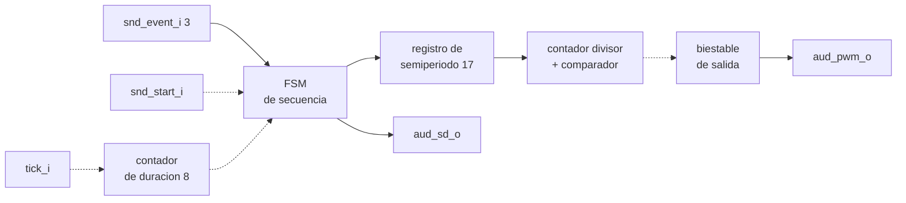

### Objetivo

Producir tonos audibles distinguibles para acierto, error, victoria y derrota.

### Entradas

| Señal | Ancho | Descripción |
|---|---|---|
| `clk_i`, `rst_i` | 1 | reloj y reinicio |
| `tick_i` | 1 | pulso de 1 ms |
| `snd_event_i` | 3 | evento a reproducir |
| `snd_start_i` | 1 | dispara la reproducción |

### Salidas

| Señal | Ancho | Descripción |
|---|---|---|
| `aud_pwm_o` | 1 | onda cuadrada hacia el amplificador |
| `aud_sd_o` | 1 | habilitación del amplificador |

### Relación con otros módulos

Recibe del `game_controller` qué evento sonar y cuándo. No consulta el estado de
la partida ni decide nada; solo reproduce.

### Funcionamiento

Al recibir un disparo, la máquina carga el semiperiodo del primer tono y arranca
dos contadores en paralelo. Uno divide el reloj para generar la frecuencia: cada
vez que alcanza el semiperiodo, invierte el biestable de salida. El otro cuenta
milisegundos hasta completar la duración del tono. Los eventos de victoria y
derrota encadenan varios tonos, así que al terminar uno la máquina carga el
siguiente.

### Diseño

**Cálculo de los semiperiodos.** Una onda cuadrada de frecuencia *f* invierte su
salida cada medio período:

```
semiperiodo en ciclos = 100 000 000 / (2 x f)
```

| Frecuencia | Semiperiodo | Frecuencia real | Error |
|---|---:|---:|---:|
| 2 000 Hz | 25 000 | 2 000,00 Hz | 0 % |
| 2 500 Hz | 20 000 | 2 500,00 Hz | 0 % |
| 3 000 Hz | 16 667 | 2 999,94 Hz | −0,002 % |
| 800 Hz | 62 500 | 800,00 Hz | 0 % |
| 500 Hz | 100 000 | 500,00 Hz | 0 % |

El único valor no exacto es el de 3 kHz, cuyo error es inaudible.

El contador divisor debe llegar hasta 100 000, así que su ancho es de 17 bits,
igual que el de la base de tiempo.

**Duraciones y contador.** Las duraciones van de 100 a 200 ms, contadas en ticks
de 1 ms, de modo que un contador de 8 bits alcanza con margen.

| Evento | Secuencia | Duración por tono |
|---|---|---:|
| Acierto | 2 kHz | 100 ms |
| Error | 500 Hz | 150 ms |
| Victoria | 2 kHz, 2,5 kHz, 3 kHz | 150 ms |
| Derrota | 800 Hz, 500 Hz | 200 ms |

**Por qué esas frecuencias.** El acierto usa un tono agudo y corto, y el error uno
grave y algo más largo, de modo que se distinguen sin necesidad de mirar la
pantalla. La victoria es una secuencia ascendente y la derrota descendente, que es
la convención que la mayoría de la gente asocia intuitivamente con éxito y
fracaso.

**Política ante eventos solapados.** Si llega un evento mientras otro suena, el
nuevo se descarta, salvo que sea de fin de partida, en cuyo caso corta el que está
sonando. Sin esta regla, dos eventos próximos producirían una mezcla
indeterminada. La excepción existe porque el sonido de fin de partida es el que no
puede perderse.

**Sobre la salida.** La Nexys 4 no lleva zumbador. El amplificador integrado
espera una señal modulada y la filtra hacia el conector de audio; una onda
cuadrada produce un tono audible perfectamente reconocible. `aud_sd_o` se mantiene
en el nivel de habilitación mientras el sistema está activo.

---

## 4.5 `led_controller`

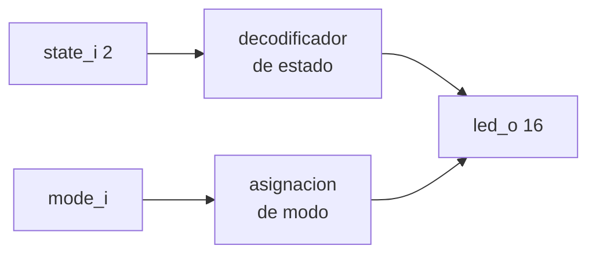

### Objetivo

Indicar en la tarjeta, sin ambigüedad, en qué etapa está el sistema y qué modo de
dificultad está seleccionado.

### Entradas

| Señal | Ancho | Descripción |
|---|---|---|
| `state_i` | 2 | etapa actual del juego |
| `mode_i` | 1 | 0 fácil, 1 difícil |

### Salidas

| Señal | Ancho | Descripción |
|---|---|---|
| `led_o` | 16 | LEDs de la tarjeta |

Parámetro: `LED_ACTIVE_LEVEL`, por defecto 1.

### Relación con otros módulos

Recibe únicamente del `game_controller`. Es puramente combinacional y no tiene
estado propio.

### Funcionamiento

Un decodificador enciende exactamente uno de los tres LEDs de estado. El LED de
modo refleja directamente la entrada correspondiente.

### Diseño

| `state_i` | Etapa | LED0 | LED1 | LED2 |
|---|---|---|---|---|
| 00 | selección de modo | 1 | 0 | 0 |
| 01 | partida en curso | 0 | 1 | 0 |
| 10 | resultado | 0 | 0 | 1 |
| 11 | no usado | 0 | 0 | 0 |

`led_o[15]` vale lo mismo que `mode_i`. Los demás bits quedan apagados.

**Por qué tres LEDs y no uno.** El requisito pide que las tres etapas sean
claramente distinguibles. Con un solo LED habría que codificarlas por patrones de
parpadeo, que a simple vista se confunden y obligan a esperar para identificar el
estado. La tarjeta tiene dieciséis LEDs, así que dedicar uno a cada etapa no
cuesta recursos y reduce la lógica a un decodificador de 2 a 3.

**Propiedad que se verifica.** Exactamente uno de los tres LEDs de estado está
encendido en todo momento. Esta condición se comprueba en el testbench mediante
una assertion, porque si alguna vez fallara significaría que el `game_controller`
está en un estado no previsto.

---

## 4.6 `top`

### Objetivo

Instanciar los dieciséis módulos, conectarlos según el plano 1 y propagar los
parámetros globales. No contiene lógica del juego.

### Entradas y salidas

Son las del nivel 1: reloj, tres pulsadores y recepción serial como entradas;
LCD, displays, LEDs, audio y transmisión serial como salidas.

### Diseño

El módulo superior cumple tres funciones y ninguna más.

La primera es declarar los parámetros globales en un solo lugar: las constantes
de tiempo y los cinco parámetros de polaridad. Cualquier ajuste posterior, como
corregir una polaridad que resultó invertida en la tarjeta, se hace aquí sin
tocar ningún módulo interno.

La segunda es instanciar y conectar. Las señales entre módulos se declaran
explícitamente, con el mismo nombre que aparece en el plano 1, de modo que el
diagrama y el código se puedan comparar línea por línea.

La tercera es aplicar las polaridades a las señales que salen a pines físicos.
Los módulos internos trabajan siempre con la convención de que uno significa
activo, y la conversión ocurre únicamente aquí.

Mantener el módulo superior sin lógica tiene una razón práctica: es el único
módulo que ningún testbench unitario cubre, porque probarlo exige el sistema
completo. Todo lo que se le añada queda fuera de la verificación por módulos.
